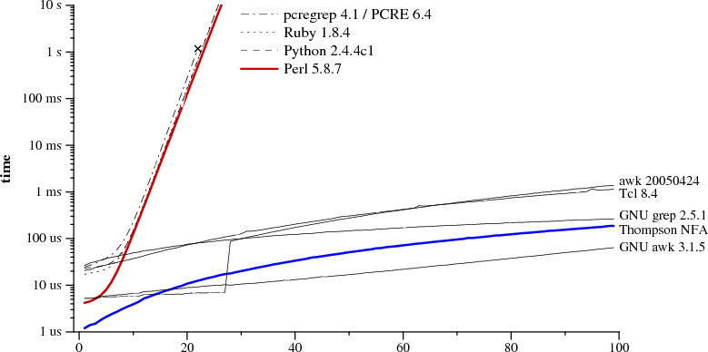

!SLIDE title
# Parsing Expression Grammars with Treetop #

  <ul>
    <li><a href="http://twitter.com/ebastien">Emmanuel Bastien</a></li>
    <li><a href="http://rivierarb.fr">Riviera.rb</a></li>
    <li>February 4, 2014</li>
  </ul>

!SLIDE
## Why do we care ? ##
* Most of your programs take some kind of input.
* Let's assume you don't blindly start processing any input.
* How do you make sure the input is valid?

!SLIDE
## The fact is: ##

    You must validate with a computational mechanism
    at least as strong as the language being validated

    -- Meredith L. Patterson

* So you build a parser,
* And now you are safe ...

!SLIDE
## ... or not !? ##
* How long does your parser take to accept or reject your input?

!SLIDE
## Chomsky hierarchy ##
* Type-0: All formal grammars
* Type-1: Context-sensitive grammars
* Type-2: Context-free grammars
* Type-3: Regular grammars

!SLIDE
## Parsing automata ##
* Type-0/1: Turing machine
* Type-2: Pushdown automaton
* Type-3: Finite state automaton

!SLIDE
* How long might a Turing machine take to accept or reject your input?

!SLIDE
## Safe places to be: ##
* At most deterministic context-free
* Or even better, regular

!SLIDE
## Use case: a full text query language ##

Subset of Lucene query syntax:

    <query> ::= [ <field> ':' ] <term>
    <term>  ::= <word> | '"' <phrase> '"'

    Examples:

    title:"regular grammar"
    keyword:parser
    rivierarb
    "finite \"state\" automaton"

!SLIDE
## Regular languages ##
* Let's use Ruby built-in regular expressions!

!SLIDE
## Regular languages ##

    @@@ruby
    # <query> ::= [ <field> ':' ] <term>
    # <term>  ::= <word> | '"' <phrase> '"'

    query = /^(\w+:)?(\w+|\"([^\"]|\\[\"])*\")$/

!SLIDE
## Ruby _regular_ expressions? ##

    @@@ruby
    "aaaaaaaaaaaaaaaaaaaaaaaaaaaaab" =~ /^(a+)+$/

!SLIDE center

!SLIDE

    Today, regular expressions have also become a
    shining example of how ignoring good theory
    leads to bad programs.

    -- Russ Cox

!SLIDE
## Regular expressions ##
* Extensions like _backreferences_ built into common standard regular expression
implementations lead to non-context-free grammars.
* In this case there is no better algorithm than exponential!
* So be careful when writting regular expressions,
* and __NEVER__ take regular expressions from untrusted input!

!SLIDE
## Use case: a more powerful query language ##

    title:"regular grammar" AND
    ( keyword:parser OR rivierarb ) AND
    "finite \"state\" automaton"

!SLIDE
## Efficient deterministic context-free parsers ##
* LR(k) -- rightmost derivation with _k_ lookahead
* LL(k) -- leftmost derivarion with _k_ lookahead
* Packrat/PEG
* Reminder: ad-hoc recursive-descent with naive backtracking
  is exponential-time!

!SLIDE
## Some concrete parsers ##
* GNU Bison (LALR)
* ANTLR (LL & more)
* Treetop (PEG)

!SLIDE
## PEG selling points ##
* Recognition-based (vs. generation-based)
* Prioritized choices
* Greedy rules
* Syntactic predicates
* No separate lexer (expression of mixed languages!)

!SLIDE
## Structure of PEGs ##
* finite set of terminals
* finite set of nonterminals N
* finite set of rules of the form A <- e where A ∈ N, e is a parsing expression
* a parsing expression called the start expression

!SLIDE
## Parsing expressions ##
* empty string
* terminal
* nonterminal
* sequence of parsing expressions
* prioritized choice between alternatives
* optional, zero-or-more, one-or-more (all greedy)
* syntactic predicates (does not consume input)

!SLIDE
    @@@ruby
    grammar Arithmetic
      rule additive
        multitive ( '+' multitive )*
      end
      rule multitive
        primary ( '*' primary )*
      end
      rule primary
        '(' additive ')' / number
      end
      rule number
        '-'? [0-9]+
      end
    end

!SLIDE
## Demo ##

!SLIDE
## Limitations ##
* Packrat parsers are not minimal in space compared to LL/LR parsers.
* Not good _as is_ for _stateful_ syntax (e.g. C and C++).
* Equality of languages generated by CFGs is undecidable.
* No proof that PEGs can generate all context-free languages.
* Left recursion is not available with PEGs.
* No built-in operator precedence support.

!SLIDE
## References ##
* [The Science of Insecurity](http://www.youtube.com/watch?v=3kEfedtQVOY)
* [Regular Expression Matching Can Be Simple And Fast](http://swtch.com/~rsc/regexp/regexp1.html)
* [Parsing Expression Grammars paper](http://pdos.csail.mit.edu/papers/parsing%3Apopl04.pdf)
* [Parsing Expression Grammars slides](http://www.brynosaurus.com/pub/lang/peg-slides.pdf)
* [Packrat Parsing and PEGs Page](http://bford.info/packrat/)
* [Treetop](http://treetop.rubyforge.org/)
* [Shunting-yard algorithm](http://en.wikipedia.org/wiki/Shunting_yard_algorithm)

